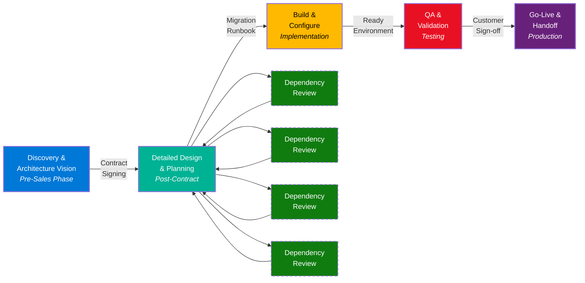
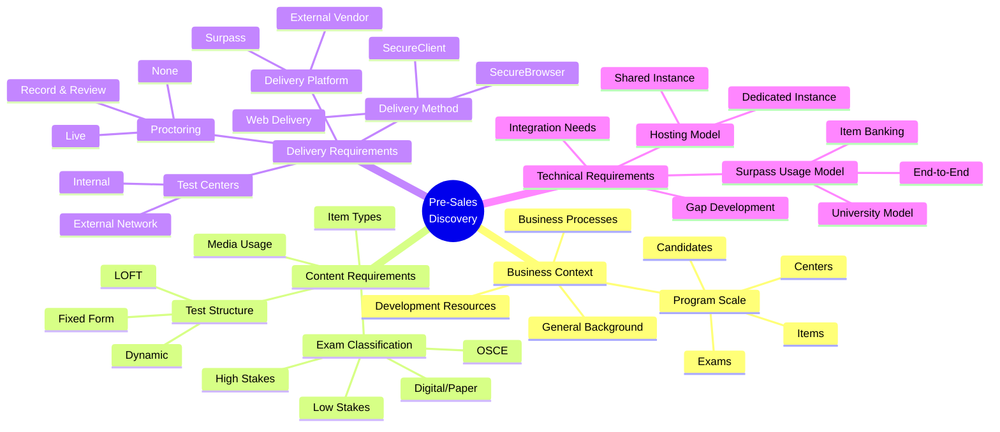
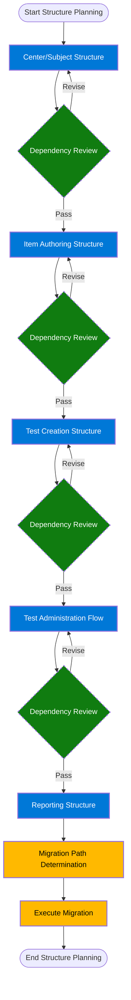
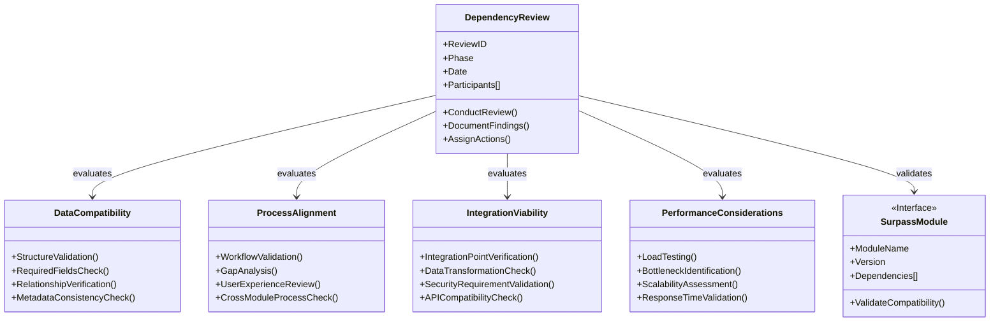
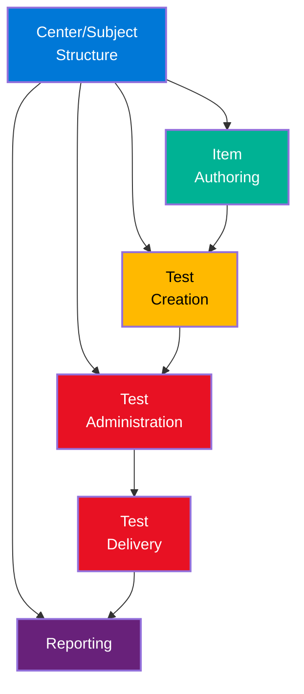
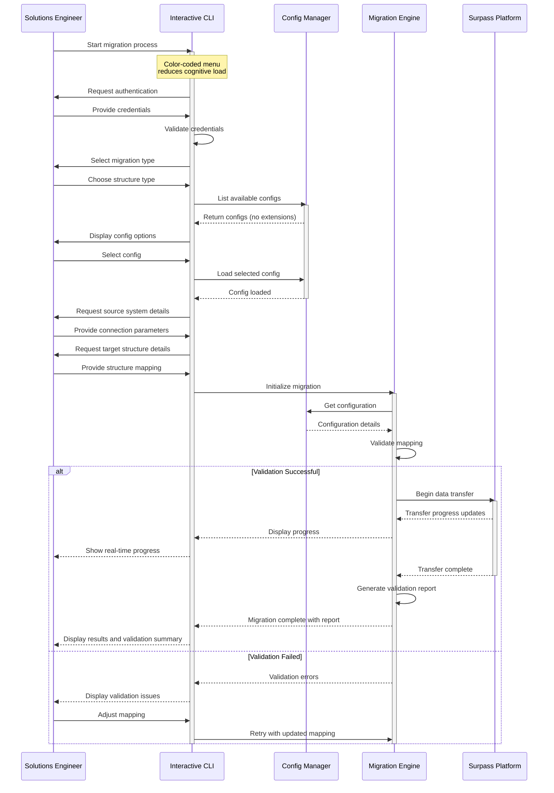
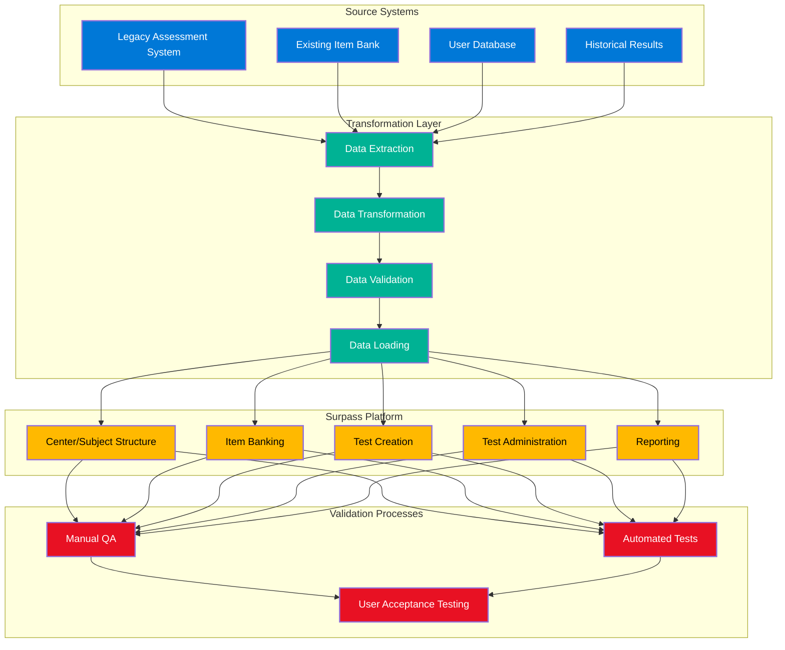
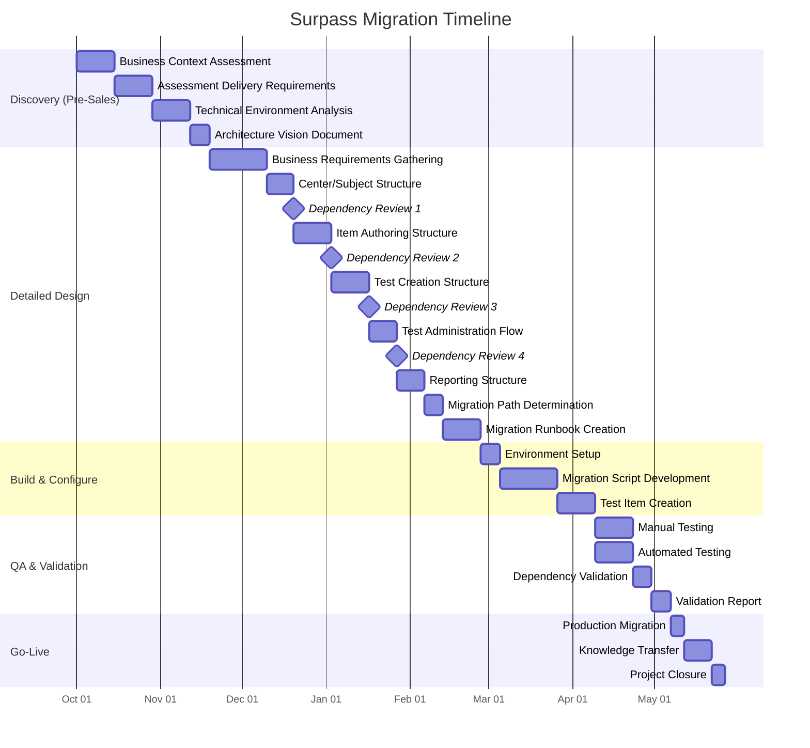

# Surpass Migration Framework

## Executive Summary

This document outlines the Surpass Migration Framework - a structured yet adaptable approach to assessment platform migrations. Built on real-world implementation experience and TOGAF principles, this framework balances the art and science of migration planning to ensure successful outcomes for diverse customer needs.

## Migration Lifecycle Overview

The Surpass Migration Framework follows a continuous, iterative approach with dependency reviews at key transition points. This ensures alignment across all Surpass modules and integration points while maintaining flexibility to adapt to customer-specific requirements.

## Phase 1: Discovery & Architecture Vision (Pre-Sales)

During pre-sales engagement, Solutions Engineers establish a high-level understanding of customer needs and technical landscape:

### Business Context Assessment
- General background of the prospect
- High-level overview of business processes
- Program scale (items, candidates, exams, centers)
- Available development resources

### Assessment Delivery Requirements
- Content types and item formats
- Media usage requirements
- Exam classification (stakes, delivery method)
- Dynamic vs. fixed form requirements

### Technical Environment Analysis
- Delivery method (Surpass or external vendor)
- Web Delivery vs. SecureClient/SecureBrowser
- Proctoring requirements
- Test center network needs
- Integration requirements
- Hosting requirements (shared instance feasibility)
- Development needs for gap coverage

### Outcome: Architecture Vision Document
- High-level migration strategy
- Preliminary timeline and resource requirements
- Initial risk assessment

## Phase 2: Detailed Design & Planning

After contract signing, the Solutions Engineer transitions to implementation planning with detailed discovery:

### Business Requirements Gathering
- Complete business requirements documentation
- Full inventory of data for migration
- Current state process mapping
- Future state process mapping

### Surpass Structure Planning

The structure planning process is iterative, with dependency reviews after each major component:

1. **Center/Subject Structure Design**
   - Hierarchical organization mapping
   - Site/Center/Subject relationships
   - Organizational boundaries

2. **Item Authoring Structure**
   - Bank structure design
   - Item metadata mapping
   - Workflow configuration
   - Media handling approach

3. **Test Creation Structure**
   - Test settings configuration
   - Development workflow establishment
   - Blueprint mapping

4. **Test Administration Flow**
   - Scheduling approach
   - Delivery settings
   - Security requirements

5. **Reporting Structure**
   - Results processing
   - Analytics requirements
   - Data export needs

### Dependency Reviews

Dependency reviews are critical checkpoints throughout the migration process:

Each dependency review should address:

1. **Data Compatibility**
   - Is data structured appropriately for all modules?
   - Are all required fields populated?
   - Are relationships preserved?

2. **Process Alignment**
   - Do configured workflows support business requirements?
   - Are there process gaps or conflicts?
   - Is the user experience optimized?

3. **Integration Viability**
   - Are all integration points properly defined?
   - Is data transformation adequate?
   - Are security requirements satisfied?

4. **Performance Considerations**
   - Will the design support expected load?
   - Are there potential bottlenecks?
   - Is scalability addressed?

### Migration Path Determination
- API utilization assessment
- UI import feature evaluation
- Manual input requirements
- Data transformation approach

### Outcome: Migration Runbook
- Detailed migration plan
- Configuration specifications
- Data mapping documentation
- Validation criteria

## Phase 3: Build & Configure

The execution phase where planning becomes reality:

### Surpass Module Relationships

Understanding the relationships between Surpass modules is critical for successful migration:

### Environment Setup
- Instance configuration
- User setup
- Integration establishment

### Migration Script Development
- Data extraction from source systems
- Transformation logic implementation
- Load procedures creation

### Interactive CLI Workflow

An interactive CLI with color-coded menus reduces cognitive load during migration execution:

### Test Item Creation
- Sample content migration
- Validation of item behavior
- Media handling verification

### Outcome: Migration-Ready Environment
- Configured Surpass instance
- Validated migration scripts
- Test data verification

## Phase 4: QA & Validation

Comprehensive testing to ensure migration success:

### Data Flow Validation

The migration data flow must be thoroughly validated:

### Manual Testing
- User acceptance testing
- Process validation
- Configuration verification

### Automated Testing
- Data integrity validation
- Performance assessment
- Integration testing

### Dependency Validation
- Cross-module functionality testing
- End-to-end process validation

### Outcome: Validation Report
- Test results documentation
- Issue resolution tracking
- Customer sign-off documentation

## Phase 5: Go-Live & Handoff

Final deployment and transition to operations:

### Production Migration
- Full data migration execution
- Final verification
- Performance monitoring

### Knowledge Transfer
- Documentation delivery
- Training completion
- Support transition

### Project Closure
- Lessons learned documentation
- Success metrics reporting
- Follow-up planning

### Outcome: Operational System
- Fully migrated Surpass implementation
- Trained customer team
- Established support channels

## Project Timeline

A typical migration project follows this timeline:

## Continuous Improvement

Post-implementation review to enhance future migrations:

- Process improvement identification
- Framework enhancement recommendations
- Best practice documentation