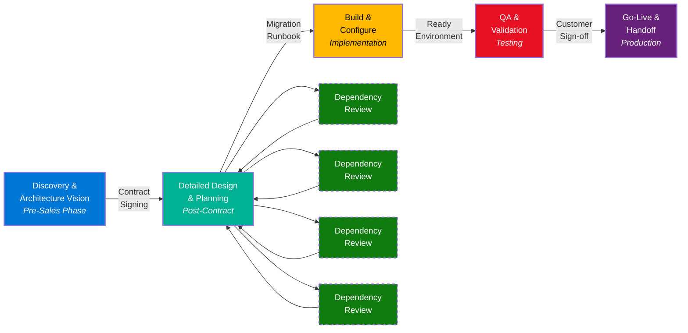
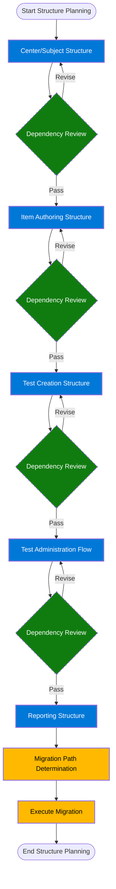
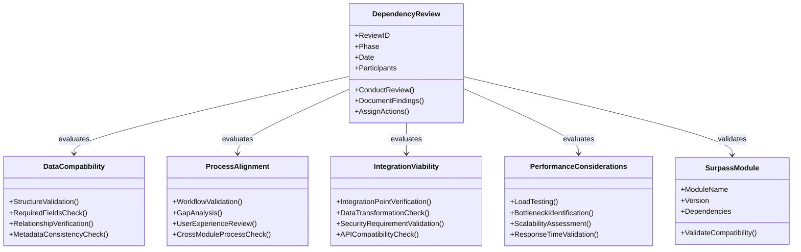
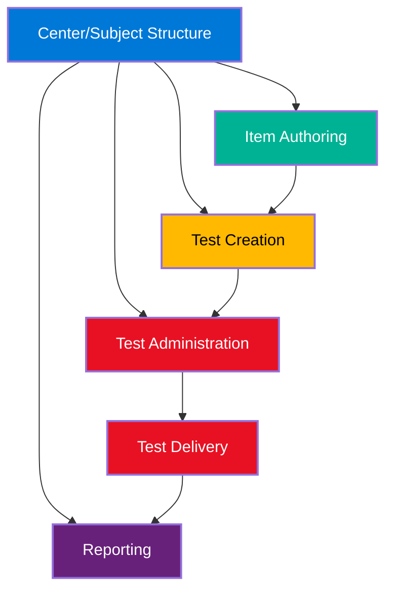
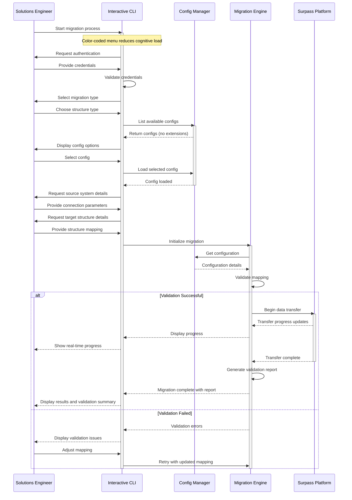
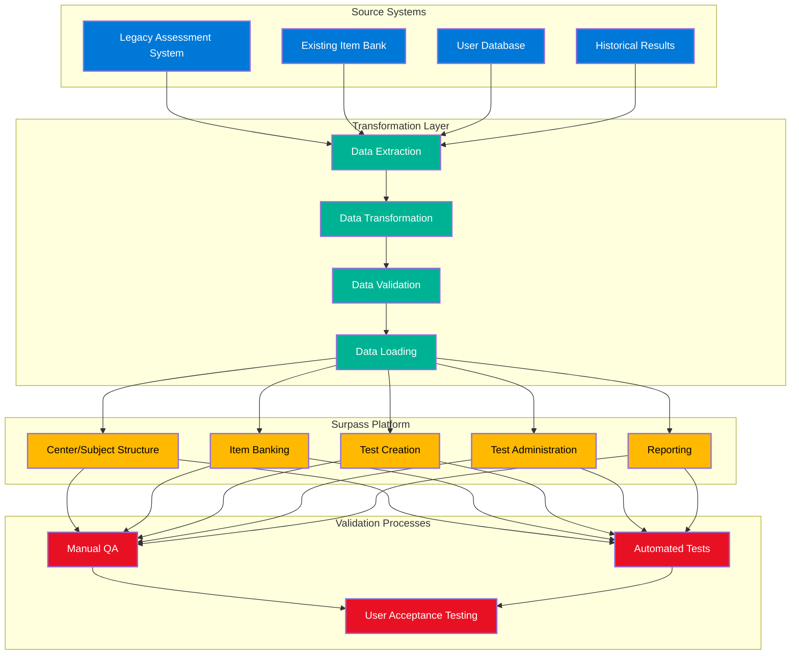
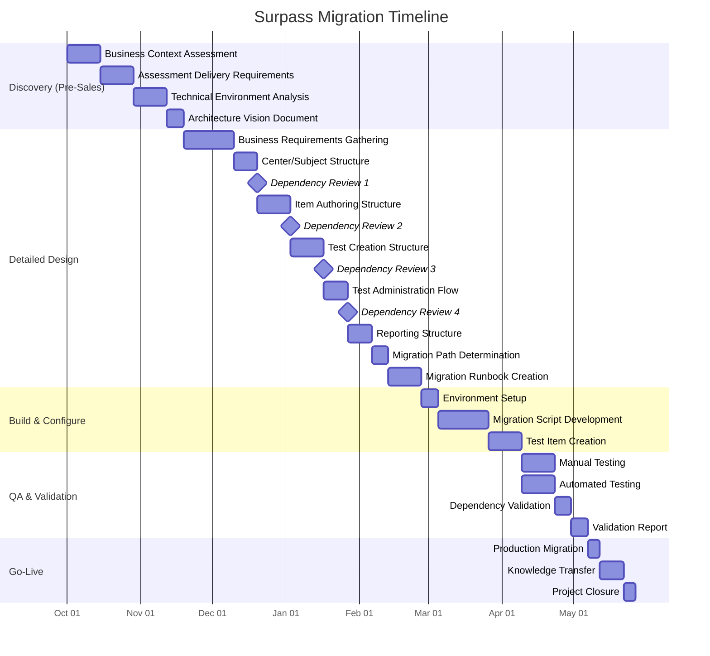

# Surpass Migration Framework

## Table of Contents

- [Executive Summary](#executive-summary)
- [Migration Lifecycle Overview](#migration-lifecycle-overview)
- [Phase 1: Discovery & Architecture Vision](#phase-1-discovery--architecture-vision-pre-sales)
- [Phase 2: Detailed Design & Planning](#phase-2-detailed-design--planning)
- [Phase 3: Build & Configure](#phase-3-build--configure)
- [Phase 4: QA & Validation](#phase-4-qa--validation)
- [Phase 5: Go-Live & Handoff](#phase-5-go-live--handoff)
- [Project Timeline](#project-timeline)
- [Continuous Improvement](#continuous-improvement)
- [Conclusion](#conclusion)

---

## Executive Summary

This document outlines the **Surpass Migration Framework** - a comprehensive, structured yet adaptable approach to assessment platform migrations. Built on real-world implementation experience and TOGAF principles, this framework balances the art and science of migration planning to ensure successful outcomes for diverse customer needs.

### Key Framework Components

- **Five-Phase Approach**: A systematic process from pre-sales discovery through go-live and handoff
- **Dependency Reviews**: Critical checkpoints ensuring alignment across all Surpass modules
- **Structured Planning**: Detailed configuration of all platform components with validation at each step
- **Interactive Tools**: Color-coded CLI workflows that reduce cognitive load during implementation
- **Comprehensive Validation**: Thorough testing methodologies to ensure migration success

This framework provides Solutions Engineers with a clear roadmap while maintaining the flexibility to address unique customer requirements. Each phase builds upon the previous one with clear deliverables and transition criteria, ensuring nothing is overlooked in the migration process.

---

## Migration Lifecycle Overview

The Surpass Migration Framework follows a continuous, iterative approach with dependency reviews at key transition points. This ensures alignment across all Surpass modules and integration points while maintaining flexibility to adapt to customer-specific requirements.

### Framework Phases at a Glance

1. **Discovery & Architecture Vision** (Pre-Sales): Initial assessment of customer needs
2. **Detailed Design & Planning**: Comprehensive configuration planning with dependency reviews
3. **Build & Configure**: Implementation of migration plans and scripts
4. **QA & Validation**: Thorough testing of all migrated components
5. **Go-Live & Handoff**: Production deployment and transition to operations

<!-- page break -->

---

## Phase 1: Discovery & Architecture Vision (Pre-Sales)

> *This phase occurs during pre-sales engagement and establishes the foundation for the migration project.*

During pre-sales engagement, Solutions Engineers establish a high-level understanding of customer needs and technical landscape:

```mermaid
flowchart TD
    %% Define styles
    classDef root fill:#0078D7, color:white, stroke-width:2px, rx:10px, ry:10px
    classDef main fill:#00B294, color:white, stroke-width:2px, rx:5px, ry:5px
    classDef sub fill:#FFB900, color:black, stroke-width:2px
    classDef detail fill:#E81123, color:white, stroke-width:2px
    
    %% Main node
    Root["Pre-Sales Discovery"]
    
    %% Level 1 categories
    Business["Business Context"]
    Content["Content Requirements"]
    Delivery["Delivery Requirements"]
    Technical["Technical Requirements"]
    
    %% Business Context nodes
    Background["General Background"]
    Processes["Business Processes"]
    Scale["Program Scale"]
    Resources["Development Resources"]
    
    %% Program Scale details
    Items["Items"]
    Candidates["Candidates"]
    Exams["Exams"]
    Centers["Centers"]
    
    %% Content Requirements nodes
    ItemTypes["Item Types"]
    Media["Media Usage"]
    ExamClass["Exam Classification"]
    TestStruct["Test Structure"]
    
    %% Exam Classification details
    HighStakes["High Stakes"]
    LowStakes["Low Stakes"]
    OSCE["OSCE"]
    DigitalPaper["Digital/Paper"]
    
    %% Test Structure details
    FixedForm["Fixed Form"]
    Dynamic["Dynamic"]
    LOFT["LOFT"]
    
    %% Delivery Requirements nodes
    Platform["Delivery Platform"]
    Method["Delivery Method"]
    Proctor["Proctoring"]
    TestCenters["Test Centers"]
    
    %% Delivery Platform details
    Surpass["Surpass"]
    ExternalVendor["External Vendor"]
    
    %% Delivery Method details
    WebDelivery["Web Delivery"]
    SecureClient["SecureClient"]
    SecureBrowser["SecureBrowser"]
    
    %% Proctoring details
    Live["Live"]
    RecordReview["Record & Review"]
    None["None"]
    
    %% Test Centers details
    Internal["Internal"]
    ExternalNetwork["External Network"]
    
    %% Technical Requirements nodes
    Integration["Integration Needs"]
    UsageModel["Surpass Usage Model"]
    HostingModel["Hosting Model"]
    GapDev["Gap Development"]
    
    %% Surpass Usage Model details
    ItemBanking["Item Banking"]
    EndToEnd["End-to-End"]
    University["University Model"]
    
    %% Hosting Model details
    Shared["Shared Instance"]
    Dedicated["Dedicated Instance"]
    
    %% Connections - Main
    Root --> Business
    Root --> Content
    Root --> Delivery
    Root --> Technical
    
    %% Connections - Business Context
    Business --> Background
    Business --> Processes
    Business --> Scale
    Business --> Resources
    
    %% Connections - Program Scale
    Scale --> Items
    Scale --> Candidates
    Scale --> Exams
    Scale --> Centers
    
    %% Connections - Content Requirements
    Content --> ItemTypes
    Content --> Media
    Content --> ExamClass
    Content --> TestStruct
    
    %% Connections - Exam Classification
    ExamClass --> HighStakes
    ExamClass --> LowStakes
    ExamClass --> OSCE
    ExamClass --> DigitalPaper
    
    %% Connections - Test Structure
    TestStruct --> FixedForm
    TestStruct --> Dynamic
    TestStruct --> LOFT
    
    %% Connections - Delivery Requirements
    Delivery --> Platform
    Delivery --> Method
    Delivery --> Proctor
    Delivery --> TestCenters
    
    %% Connections - Delivery Platform
    Platform --> Surpass
    Platform --> ExternalVendor
    
    %% Connections - Delivery Method
    Method --> WebDelivery
    Method --> SecureClient
    Method --> SecureBrowser
    
    %% Connections - Proctoring
    Proctor --> Live
    Proctor --> RecordReview
    Proctor --> None
    
    %% Connections - Test Centers
    TestCenters --> Internal
    TestCenters --> ExternalNetwork
    
    %% Connections - Technical Requirements
    Technical --> Integration
    Technical --> UsageModel
    Technical --> HostingModel
    Technical --> GapDev
    
    %% Connections - Surpass Usage Model
    UsageModel --> ItemBanking
    UsageModel --> EndToEnd
    UsageModel --> University
    
    %% Connections - Hosting Model
    HostingModel --> Shared
    HostingModel --> Dedicated
    
    %% Apply classes
    class Root root
    class Business,Content,Delivery,Technical main
    class Background,Processes,Scale,Resources,ItemTypes,Media,ExamClass,TestStruct,Platform,Method,Proctor,TestCenters,Integration,UsageModel,HostingModel,GapDev sub
    class Items,Candidates,Exams,Centers,HighStakes,LowStakes,OSCE,DigitalPaper,FixedForm,Dynamic,LOFT,Surpass,ExternalVendor,WebDelivery,SecureClient,SecureBrowser,Live,RecordReview,None,Internal,ExternalNetwork,ItemBanking,EndToEnd,University,Shared,Dedicated detail
```

### Business Context Assessment

| **Area** | **Key Considerations** |
|:---------|:----------------------|
| **General Background** | Organization type, industry, size, geographic reach |
| **Business Processes** | Current assessment workflows, pain points, goals |
| **Program Scale** | Number of items, candidates, exams, centers required |
| **Development Resources** | Available technical resources, skill sets, capacity |

### Assessment Delivery Requirements

| **Area** | **Key Considerations** |
|:---------|:----------------------|
| **Content Types** | Multiple choice, essay, performance-based, multimedia |
| **Media Usage** | Images, audio, video, interactive elements |
| **Exam Classification** | High/low stakes, OSCE, digital/paper delivery |
| **Test Structure** | Fixed form, dynamic, LOFT requirements |

### Technical Environment Analysis

| **Area** | **Key Considerations** |
|:---------|:----------------------|
| **Delivery Method** | Surpass native or external vendor integration |
| **Client Technology** | Web delivery, SecureClient, SecureBrowser requirements |
| **Proctoring** | Live, record & review, or no proctoring needs |
| **Test Centers** | Internal facilities or external network requirements |
| **Integration** | Required system integrations and data exchange needs |
| **Hosting** | Shared instance feasibility, dedicated requirements |
| **Development** | Gap coverage needs, custom development requirements |

### Outcome: Architecture Vision Document

| **Component** | **Deliverables** |
|:--------------|:----------------|
| **Migration Strategy** | High-level approach to migration, phasing considerations |
| **Timeline** | Preliminary timeline with major milestones |
| **Resources** | Initial resource requirements and allocations |
| **Risk Assessment** | Identification of key risks and mitigation strategies |

<!-- page break -->

---

## Phase 2: Detailed Design & Planning

> *This phase begins after contract signing and focuses on detailed implementation planning.*

After contract signing, the Solutions Engineer transitions to implementation planning with detailed discovery:

### Business Requirements Gathering

| **Area** | **Key Deliverables** |
|:---------|:---------------------|
| **Business Requirements** | Complete documentation of all business requirements |
| **Data Inventory** | Full inventory of data requiring migration |
| **Current State** | Mapping of current processes and data structures |
| **Future State** | Mapping of desired processes and data structures |

### Surpass Structure Planning

The structure planning process is iterative, with dependency reviews after each major component:

#### Center/Subject Structure Design

| **Component** | **Configuration Details** |
|:--------------|:------------------------|
| Hierarchical Organization | Mapping of organizational hierarchy to Surpass structure |
| Site/Center/Subject | Relationship mapping between sites, centers, and subjects |
| Organizational Boundaries | Definition of access boundaries and permissions |

#### Item Authoring Structure

| **Component** | **Configuration Details** |
|:--------------|:------------------------|
| Bank Structure | Design of item bank organization and hierarchy |
| Item Metadata | Mapping of metadata fields and taxonomies |
| Workflow Configuration | Definition of authoring and review workflows |
| Media Handling | Approach for handling media assets and resources |

#### Test Creation Structure

| **Component** | **Configuration Details** |
|:--------------|:------------------------|
| Test Settings | Configuration of test settings and parameters |
| Development Workflow | Establishment of test development processes |
| Blueprint Mapping | Mapping of test blueprints to item selection criteria |

#### Test Administration Flow

| **Component** | **Configuration Details** |
|:--------------|:------------------------|
| Scheduling Approach | Configuration of scheduling options and constraints |
| Delivery Settings | Settings for test delivery and security |
| Security Requirements | Implementation of security controls and monitoring |

#### Reporting Structure

| **Component** | **Configuration Details** |
|:--------------|:------------------------|
| Results Processing | Configuration of results calculation and processing |
| Analytics Requirements | Setup of analytics and reporting capabilities |
| Data Export | Configuration of data export formats and schedules |

<!-- page break -->

### Dependency Reviews

Dependency reviews are critical checkpoints throughout the migration process:

#### Dependency Review Components

| **Review Area** | **Key Questions** |
|:---------------|:----------------|
| **Data Compatibility** | • Is data structured appropriately for all modules? • Are all required fields populated? • Are relationships preserved? |
| **Process Alignment** | • Do configured workflows support business requirements? • Are there process gaps or conflicts? • Is the user experience optimized? |
| **Integration Viability** | • Are all integration points properly defined? • Is data transformation adequate? • Are security requirements satisfied? |
| **Performance Considerations** | • Will the design support expected load? • Are there potential bottlenecks? • Is scalability addressed? |

### Migration Path Determination

| **Approach** | **Evaluation Criteria** |
|:------------|:-----------------------|
| API Utilization | API availability, throughput, rate limits, authentication |
| UI Import Features | Feature availability, data volume limitations, validation |
| Manual Input | Resource requirements, time constraints, error potential |
| Data Transformation | Complexity, validation requirements, mapping challenges |

### Outcome: Migration Runbook

| **Component** | **Deliverables** |
|:--------------|:----------------|
| Migration Plan | Detailed step-by-step migration procedures |
| Configuration Specs | Complete configuration specifications |
| Data Mapping | Comprehensive data mapping documentation |
| Validation Criteria | Defined criteria for successful migration |

<!-- page break -->

---

## Phase 3: Build & Configure

> *This is the execution phase where planning becomes reality through implementation of migration components.*

The execution phase where planning becomes reality:

### Surpass Module Relationships

Understanding the relationships between Surpass modules is critical for successful migration:

### Environment Setup

| **Component** | **Implementation Details** |
|:--------------|:--------------------------|
| Instance Configuration | Setup of Surpass instance with appropriate settings |
| User Setup | Creation of administrative and test users |
| Integration Establishment | Configuration of integration points and connections |

### Migration Script Development

| **Component** | **Implementation Details** |
|:--------------|:--------------------------|
| Data Extraction | Scripts for extracting data from source systems |
| Transformation Logic | Logic for transforming data to Surpass format |
| Load Procedures | Procedures for loading data into Surpass |

<!-- page break -->

### Interactive CLI Workflow

An interactive CLI with color-coded menus reduces cognitive load during migration execution:

### Test Item Creation

| **Component** | **Implementation Details** |
|:--------------|:--------------------------|
| Sample Content | Migration of representative sample content |
| Item Behavior | Validation of item behavior and functionality |
| Media Handling | Verification of media asset handling and display |

### Outcome: Migration-Ready Environment

| **Component** | **Deliverables** |
|:--------------|:----------------|
| Configured Instance | Fully configured Surpass instance |
| Validated Scripts | Tested and validated migration scripts |
| Test Data | Verified test data and validation results |

<!-- page break -->

---

## Phase 4: QA & Validation

> *This phase involves comprehensive testing to ensure migration success and data integrity.*

Comprehensive testing to ensure migration success:

### Data Flow Validation

The migration data flow must be thoroughly validated:

### Testing Approaches

| **Approach** | **Testing Activities** |
|:------------|:---------------------|
| **Manual Testing** | • User acceptance testing • Process validation • Configuration verification |
| **Automated Testing** | • Data integrity validation • Performance assessment • Integration testing |
| **Dependency Validation** | • Cross-module functionality testing • End-to-end process validation |

### Outcome: Validation Report

| **Component** | **Deliverables** |
|:--------------|:----------------|
| Test Results | Documentation of all test results |
| Issue Resolution | Tracking of issues and resolution status |
| Customer Sign-off | Documentation of customer approval |

<!-- page break -->

---

## Phase 5: Go-Live & Handoff

> *This final phase encompasses production deployment and transition to ongoing operations.*

Final deployment and transition to operations:

### Production Migration

| **Component** | **Implementation Details** |
|:--------------|:--------------------------|
| Data Migration | Execution of full data migration |
| Verification | Final verification of migrated data |
| Performance | Monitoring of system performance |

### Knowledge Transfer

| **Component** | **Implementation Details** |
|:--------------|:--------------------------|
| Documentation | Delivery of all system documentation |
| Training | Completion of user and admin training |
| Support | Transition to ongoing support channels |

### Project Closure

| **Component** | **Implementation Details** |
|:--------------|:--------------------------|
| Lessons Learned | Documentation of lessons learned |
| Success Metrics | Reporting on project success metrics |
| Follow-up | Planning for follow-up activities |

### Outcome: Operational System

| **Component** | **Deliverables** |
|:--------------|:----------------|
| Migrated Implementation | Fully migrated Surpass implementation |
| Trained Team | Customer team trained on system use |
| Support Channels | Established support channels |

<!-- page break -->

---

## Project Timeline

A typical migration project follows this timeline:

---

## Continuous Improvement

> *The migration framework incorporates ongoing refinement based on lessons learned and evolving best practices.*

| **Area** | **Activities** |
|:--------|:--------------|
| Process Improvement | Identification of process improvement opportunities |
| Framework Enhancement | Recommendations for framework enhancements |
| Best Practices | Documentation of best practices for future migrations |

---

## Conclusion

The Surpass Migration Framework provides a comprehensive, structured approach to assessment platform migrations while maintaining the flexibility needed to address unique customer requirements. By following this framework, Solutions Engineers can:

- Ensure all critical components are properly addressed
- Maintain alignment across interdependent modules
- Validate configurations at each step of the process
- Deliver successful migrations with minimal disruption

This framework continues to evolve based on lessons learned from each implementation, ensuring that best practices are incorporated into future migrations.
